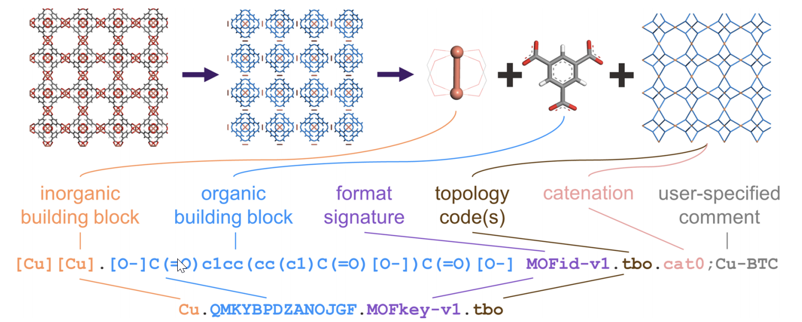

# MOFid website

The MOFid code has many utilities, two of which can be run in your web browser:

1. **Generate a MOFid/MOFkey**: The [ID tool](sbu.html) allows you to deconstruct a MOF into its building blocks for the purposes of generating a MOFid/MOFkey, requiring only a CIF as the input.
2. **Run queries on the CoRE MOF database**: The [Search Tool](searchdb.html) runs queries against the CoRE MOF 2019-ASR [database](https://zenodo.org/record/3677685) of ~15,000 MOFs.

## Understanding the Structure of MOFid/MOFkey

As outlined in the original [MOFid paper](https://pubs.acs.org/doi/abs/10.1021/acs.cgd.9b01050), MOFid and MOFkey take the following format (shown below for Cu-BTC): 

The longer string is the MOFid. It can be a bit lengthy, but it is relatively simple to interpret simply by looking at it. The organic building block is encoded based on [SMILES](https://en.wikipedia.org/wiki/Simplified_molecular-input_line-entry_system), meaning you can copy and paste it into a program like ChemDraw, and it'll render appropriately. The semicolon and text following it at the end of the MOFid is an optional user comment. By default, the MOFid web platform will use the basename of the CIF as the user comment. We recommend simply putting the colloquial name of the MOF there.

The shorter string is the MOFkey. It is a hashed version of the MOFid. Since it is shorter, one potential use-case is to report the MOFkey in the main text of a manuscript, with the longer MOFid being reported in the SI. However, it's up to you! Both represent the same MOF, and you can report them how you see fit.

## Tips for Generating MOFids/MOFkeys

To generate an accurate MOFid/MOFkey, disorder should not be present in the structure. The ID tool will attempt to automatically remove solvent from the framework, if present. Molecules or ions that are not part of the framework should be manually removed from the CIF before generating the MOFid/MOFkey.

Please note that the tools may require a few seconds to run the analysis after you click "submit." All analysis is performed locally on your own machine. If the analysis stalls and does not complete after a few minutes for some reason, please refresh the page and try again.

If you receive an error message of "Exception thrown, see JavaScript console," it is often because the CIF parser is having trouble reading the formatting of your CIF. Try reading in your CIF in a program like [VESTA](https://jp-minerals.org/vesta/en/download.html) and re-exporting it as a CIF to see if that resolves the issue. Make sure to refresh the page before uploading your modified CIF.

## Citing MOFid/MOFkey
If you use MOFid/MOFkey in your work, please cite the following reference:

B.J. Bucior, A.S. Rosen, M. Haranczyk, Z. Yao, M.E. Ziebel, O.K. Farha, J.T. Hupp, J.I. Siepmann, A. Aspuru-Guzik, R.Q. Snurr. "Identification Schemes for Metal–Organic Frameworks To Enable Rapid Search and Cheminformatics Analysis", _Cryst. Growth Des._, 19, 6682-6697 (2019).

## Further Information

The main project [GitHub repository](https://github.com/snurr-group/mofid) includes a downloadable C++/Python code (for generating the MOFids for a large number of MOFs), [example CIFs for analysis](https://github.com/snurr-group/mofid/tree/master/Resources/TestCIFs), and credits for third-party software.

This work is supported by the U.S. Department of Energy, Office of Basic 
Energy Sciences, Division of Chemical Sciences, Geosciences and 
Biosciences through the Nanoporous Materials Genome Center under award 
DE-FG02-17ER16362.
